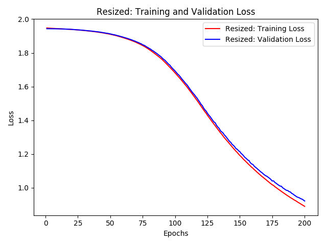

CSC482 Final project
Jonathan Morton | Jun Tae Son

# Character recognition using a CNN

## Abstract
Japanese is one of the most challenging languages for handwritten character recognition due to its tremendous volume of characters and possible variations in handwritten stroke. However, the development of powerful GPUs and various character recognition techniques has significantly improved learning efficiency and performance of recognition models. In this paper, we examined the performance of a handwritten Japanese character recognition model based on a deep convolutional neural network architecture and explored the robustness of the algorithm by adding sparsity, noise, and random distortion such as rotation, width/height shift, and shear transformation. We tested the CR model on a subset of the ETL Character Database. The combined data set with resized, sparse, and noisy sparse characters achieved 94.8% accuracy on the validation set.

## 1. Introduction
Since the first character recognizer for Latin characters was invented in the middle of 1940s, many optical character recognition approaches for different languages have been developed. (N. Arica 2001). In this paper, we will explore one form of a character recognition system, focusing on Japanese characters. The Japanese language is written in the mixture of the following three different scripts; 46 characters of hiragana (ひらがな), 46 characters of katakana (カタカナ), and about 2,000 of daily-used Chinese characters (kanji 漢字). Japanese OCR is challenging because there is a tremendous amount of characters as well as possible variations in hand written strokes.

In this project, we designed a Deep Convolutional Neural Networks model for recognizing handwritten Japanese character. Since our computing system was limited, we took a subset of 7 kanji characters. We applied character distortion such as rotation, sparsity and noise addition to generate artificial characters so that we can ensure the robustness of the algorithm and how the character distortion affects the performance. 

In the next sections, we will discuss 1) the background of character recognition approaches, 2) methodologies of the proposed algorithm that we implemented in this project, 3) evaluation results of the proposed algorithm, and lastly 4) our conclusion and limitations of our model.

## 2. Background
Anil et al. suggested the following four best approaches for character recognition in 2000; 1) template matching, 2) statistical classification, 3) structural matching, and 4) neural networks. 

We will discuss first three approaches in this section and explore neural network architecture further in the methodology section.

_Template matching_ has been widely used because it was one of the simplest and earliest approach for character recognition system. In template matching, a pattern to be recognized is matched against the stored template to determine the similarity between two entities. But it has significant disadvantages: 1) it does not perform well when the patterns are distorted, and 2) its computational cost is expensive.

_Statistical techniques_ are another approach for the character recognition systems. In statistical approach, we classify patterns based on a set of extracted features by establishing decision boundaries in the feature space. A good statistical model will discriminate the pattern well from different classes. 

_Structural pattern recognition_ is also a significant technique in the CR fields. It assumes that the pattern structures extracted from text are quantifiable, thus we can find relations among the structural patterns. Based on the rule of linguistics (e.g. grammer) and the stored structural description (e.g. stroke and relationships among characters), structural approach attempts to create production rules to recognize unknown character so that it can decrease the recognition error.

## 3. Methodology
**3-1. Data**
The dataset used in this project comes from the ETL Character Database collected by the National Institute of Advanced Industrial Science and Technology (AIST) under cooperation with Japan Electronics and Information Technology Industries Association, universities and other research organizations for character recognition researches from 1973 to 1984.

An example character from the data.

In the original dataset (ETL-8G), there are 956 unique Japanese characters and 154,000 corresponding gray-scale images written by 161 people. The size of the images is 128x127 pixels. Due to the limited GPU computing power, we took a subset of 7 characters ["月","火","水","木","金","土","日"] for a total of 1127 examples. Each character equally contains 161 images. The characters chosen are very common in many everyday words and are all used to write days of the week.

**3-2. Pre-processing**
We normalized all pixel values into the range [0, 1] to speed training of the weights for the neural network. Due to memory constraints, we transformed the images to be 32x32. After resizing, the following five datasets were created:

**Resized:** The 32x32 resized images 
**Sparse:** The images were converted to a sparse array by inverting the image and using the Otsu thresholding method to separate the character from the background to make a binary image 
**Noisy Sparse:** The sparse images with salt and pepper noise added 
**Mixed:** Combined data set with resized, sparse, and noisy sparse characters 
**Augmented**: Generated images from the mixed data set that have a random set of augmentations to the image; rotations up to 20 degrees, width and height shift of up to 20%, and shear transforms up to 0.2 degrees

 
Example Sparse Character

In Graham (2014), sparse arrays were shown to train networks more efficiently. Graham’s final most accurate model used a combination of various transforms and image augmentation techniques. Noise had not been previously examined in our researched and was chosen as a possible way for making training more robust. 

Finally, a training set and test set were created from the five data sets using a 75%-25% split.

**3-3. CNN**
The model consisted of three convolution layers with a filter size of 3x3 and a ReLU activation function. The first two layers used 32 filters and were followed by Max-Pooling layers with a filter size of 2x2. The final convolutional layer used 16 filters. The model was flattened and followed by a fully connected layer of size 32. The final output layer was of size 7 and used a Softmax function for classification into the 7 categories.
 
The model trained on each data set for 200 epochs with a batch size of 8 (due to memory issues) and used an Adam optimizer with an initial learning rate of 1e-5 and loss function of categorical_crossentropy.

## 4. Evaluation Results
We trained the model on five different data sets to see how image variations affect the classification performance. According to the accuracy score results shown below, the sparse array representation of data significantly improved the performance from 73.05% to 93.97% by boosting the learning speed. Adding salt and pepper noise on the sparse data slightly decreased the classification accuracy. The mixed data with all resized, sparse, and noisy sparse images achieved the highest accuracy score (94.80%) due to the larger set of training images. However, the random distortion of the images such as rotation and height/width shift sharply decreased the accuracy by 67.26%.

| **Dataset** | **Accuracy** |
| --- | --- |
| Resized | 73.05% |
| Sparse | 93.97% |
| Noisy Sparse | 92.91% |
| Mixed | 94.80% |
| Augmented | 67.26% |

Within the mixed model, relatively high recall and precision were observed for nearly all characters, with 木 performing poorly in recall

| **Character** | **Precision** | **Recall** |
| --- | --- | --- |
| **月** | 92.04% | 92.04% |
| **火** | 100% | 97.27% |
| **水** | 98.23% | 91.74% |
| **木** | 94.55% | 84.55% |
| **金** | 98.44% | 96.18% |
| **土** | 100% | 96.49% |
| **日** | 94.62% | 91.79% |

As Graham showed, all data sets using sparse data trained much more efficiently. For comparison, the accuracy on the resized data vs the accuracy on the mixed data over time:

 
 

Over 200 epochs, the mixed model was able to achieve the best result. However, none of the models showed major signs of overfitting to the data. Given faster hardware environment, training the models for more epochs is expected to show better absolute accuracy, recall, and precision of the models before overfitting occurs. The augmented data set had the worst overall performance at 200 epochs, but given the random nature of the data, a longer training time would be needed to fully gain insight into its accuracy.

## 5. Conclusion

Ultimately a model with a combination of the actual handwritten character, the sparse array representation, and noisy sparse array representation proved the most accurate over 200 epochs with an overall accuracy of 94.80% The models with sparse array characters were all able to achieve higher accuracy over a shorter amount of time compared to the other models. Noise lowered the accuracy compared to clean sparse representation, but only by 1%, with little difference in efficiency of training. The effects of adding noise to increase the robustness of network is inconclusive with such close results.

However, none of the models exhibited signs of overfitting after 200 epochs. Further training on more powerful hardware should be explored to find the ultimate limits of the different models.

**References:**

LeCun, Y., &amp; Boser, B. (1989, Winter). Backpropagation Applied to Handwritten Zip Code Recognition. Neural Computation, 1(4), 541-551.

Patil, P.M. &amp; Sontakke, T.R.. (2007). Rotation, scale and translation invariant handwritten Devanagari numeral character recognition using general fuzzy neural network. Pattern Recognition. 40. 2110–2117.

Das, Soumendu, and Sreeparna Banerjee. &quot;An algorithm for Japanese character recognition.&quot; International Journal of Image, Graphics and Signal Processing 7, no. 1 (2014): 9.

D. Ciregan, U. Meier and J. Schmidhuber, &quot;Multi-column deep neural networks for image classification,&quot; 2012 IEEE Conference on Computer Vision and Pattern Recognition, Providence, RI, 2012, pp. 3642-3649.

Graham, B. (2014). Spatially-sparse convolutional neural networks. CoRR, abs/1409.6070.

N. Arica and F. T. Yarman-Vural, &quot;An overview of character recognition focused on off-line handwriting,&quot; in IEEE Transactions on Systems, Man, and Cybernetics, Part C (Applications and Reviews), vol. 31, no. 2, pp. 216-233, May 2001.

Yang, W., Jin, L., Xie, Z., &amp; Feng, Z. (2015). Improved Deep Convolutional Neural Network For Online Handwritten Chinese Character Recognition using Domain-Specific Knowledge. ICDAR &#39;15 Proceedings of the 2015 13th International Conference on Document Analysis and Recognition (pp. 551-555). ICDAR.

Lai, S., Jin, L., &amp; Yang, W. (2017, April 1). Toward high-performance online HCCR: A CNN approach with DropDistortion, path signature, and spatial stochastic max-pooling. Pattern Recognition Letters, 89, 60-66.

A. K. Jain, R. P. W. Duin, and J. Mao, &quot;Statistical pattern recognition: A review,&quot; IEEE Trans. Pattern Anal. Machine Intell., vol. 22, pp. 4–38, Jan. 2000.

**Appendix**

 
 

 
 

 
 

 
 

 
 

